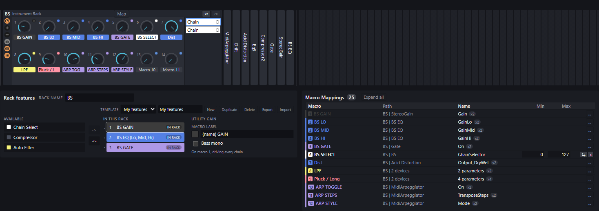
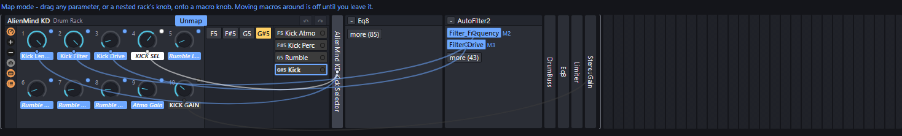
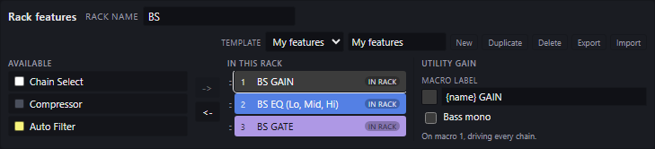

# ableton-rackutils

A toolkit for Ableton rack files (`.adg`). Rearrange the macro knobs on a rack,
see what each one actually drives, and rename or recolour them - from a web
page, or from the command line.

**Live site:** https://alienmind.github.io/ableton-rackutils/

> **v0.4.2, beta.** The editor works end to end: open a rack, rearrange and
> rebind its macros, add the features you want every rack of yours to have,
> save, and load the result back into Live. Racks the contract authored have
> made that round trip and been played. See
> [What works today](#what-works-today).

> **Keep backups anyway.** This tool rewrites rack files. The codec is covered
> by 189 tests, 88 of them against real racks saved by Live, the editor by 60
> more, and the site by 49 that drive a real browser - and a preset that loads
> without complaint and behaves subtly differently is still the failure mode
> testing catches last. Racks with Macro Variations deserve a listen before you
> trust the result.

## Your files stay on your machine

The website is a static page with no backend and no account. Your `.adg` is
opened, edited, and rebuilt inside your browser tab. There is no server for it
to be uploaded to.

## Why it works on files

Live keeps macro mappings to itself. You can see and change them by hand in
Live, but they are not open to plugins or scripts, so a tool like this one has
to go through the saved rack file: save the rack from Live, change it here,
load it back. ([Details](doc/DEVELOPERS.md#why-this-tool-edits-files).)

What that means in practice:

- Save the rack to disk first (click the disk icon in the rack's title bar, or
  drag the rack into Live's browser). The saved file is what gets edited.
- Anything you changed since that save is not in the file, so it will not be
  in the result.
- To see your edit in Live, drag the modified file back onto the rack.

## What works today

| | Status |
|---|---|
| Open a rack in the browser and see its macros, chains and drum pads | works |
| Rearrange, rename, recolour and rebind macros in the browser | works |
| Save the result and load it back into Live | works, confirmed by ear |
| Save back over the file you opened, instead of downloading a copy | works in Chromium, opt-in per save |
| Inspect and rearrange macros from the command line | works |
| Add a gain, a gate, a compressor, a filter or an EQ to every chain at once, on one macro | works |
| Put a chain selector on a macro | works on a rack; on a DRUM rack, see below |
| See which plugins a rack needs, and name them from your VST3 folder | works in Chromium |
| See a macro that drives a plugin parameter | works, read only |
| Companion Max for Live device | works - the same editor, offline, inside Live |
| Open a rack on a phone | works; the file picker offers every file and the rack is recognised by its bytes |
| Use it on a phone | the rack row scrolls with a finger, and a knob drag needs a short hold first |

One known fault: on a drum rack, a chain selector added ALONGSIDE several other
features stops selecting, though each of them is fine on its own. It is
bisected, not fixed - if you use that combination, check the knob in Live
before trusting the rack.

## The command line tools

Needs Node 20+ and pnpm 10.

```bash
git clone https://github.com/alienmind/ableton-rackutils
cd ableton-rackutils
pnpm install
```

### See what your macros are wired to

```bash
pnpm adg-tool mappings my-rack.adg
```

```
AlienMind Drum Rack - 8 visible macros
  Macro 2 (DR GAIN) -> Gain [0..56.2341309]
  Macro 3 (EQ LOW) -> GainLo [0.0003162277571..1.99526238]
  Macro 4 (EQ MID) -> GainMid [0.0003162277571..1.99526238]
```

The numbers in brackets are the range that macro sweeps the parameter across.
A macro can drive several parameters at once, so a line can list more than one.

### Move a macro to a different knob

```bash
pnpm adg-tool move my-rack.adg 1 5 out.adg
```

Moves macro 1 to position 5, taking its name, colour, value, every parameter it
drives, and its variation values with it. Macros 2 through 5 slide up by one to
make room, exactly as dragging the knob would. Nothing is overwritten and
nothing is lost.

Then drag `out.adg` from your file manager onto the rack in Live to load it.

If you want to move only what a knob drives and leave its name and colour
behind, `move-mapping` takes the same arguments and does that instead.

## What it looks like

[](doc/shots/editor.png)

The rack drawn the way Live draws it, the features that were applied to it on
the left, and every mapping it has underneath.

[](doc/shots/map-mode.png)

Map mode: every mapping in the rack as a cable, including the ones that reach
into a nested rack. A cable to a parameter inside a closed device ends at the
device until you open it.

[](doc/shots/features.png)

Features go in from the left and come back out from the right. The order of the
list is the order the knobs land in, and a set of them is a template you can
apply to the next rack.

There is a [screen recording](doc/shots/demo.webm) of it in use, and the rest
of the pictures are in [`doc/shots/`](doc/shots).

## The website

Open https://alienmind.github.io/ableton-rackutils/ and drag a `.adg` onto the
page. It works offline once loaded, and on a machine with no Ableton installed.

The page walks you through getting a rack out of Live in four steps, then
lays the rack out the way Live does: macro knobs, chains, and devices running
left to right, with nested racks and drum pad grids drawn in place.

- **Rack features**, above the rack: pick one on the left and it lands in
  every chain at once - a Utility, a Gate, a Compressor, an Auto Filter, EQ
  Three, or a knob that selects the chain - on one macro, in the same slot, in
  the colour and under the name you gave it. Pick it again on the right to take
  it back out. Export those choices to a file and the next rack comes out the
  same.
- **Map** turns on binding, the way Live's own Map button does. While it is on,
  drag a parameter - or a nested rack's knob - onto a macro knob, and every
  mapping the rack already has is drawn as a cable.
- **Drag a knob onto another** to move that macro, or hold Shift to swap two.
- **Double-click** a name to rename it, click a swatch to recolour it.
- Under the rack, every mapping is listed in full: rack, macro, device,
  parameter, and the range it sweeps. Sort it by any of the first three, or
  click again for the order the rack is written in.
- **Plugins**, above the rack, when it has any: what the rack needs in order to
  load. A `.adg` stores no plugin name, only an id, so point the page at your
  VST3 folder once and it finds which file each id lives in. One it cannot find
  is the useful answer: that rack will not fully load on this machine.

If the rack already has a knob doing a feature's job - a Utility gain you wired
by hand - the strip asks whether to reuse it rather than quietly taking the
parameter off it. Reuse it and that knob becomes the feature, keeping its
mapping and gaining the chains it was missing.

The knob is still a placeholder shape, though the colours are Live's own.

**Export** downloads a copy named after the rack and never touches your
original. **Save over the original** appears once you have opened the rack
through the file picker, takes a second click that names the file, and is the
only thing here that can overwrite anything.

## The companion device (optional)

A Max for Live device, downloadable from the site, that carries the same editor
inside Live. It adds no editing capability - what it adds is reach: the editor
with no browser and no network, which is what you want on a flight. Everything
the tool does works without it.

Drop it on any track (it is a passthrough audio effect, so it changes nothing
you hear) and press **Open**. Unpack the download whole: the device reads the
folder that ships next to it, and the installer scripts put both into your User
Library. Needs Live 12 and Max for Live.

## Contributing

Development setup, repo layout, the schema findings, and the plan are in
[`doc/DEVELOPERS.md`](doc/DEVELOPERS.md).

## License

[MIT](LICENSE)
