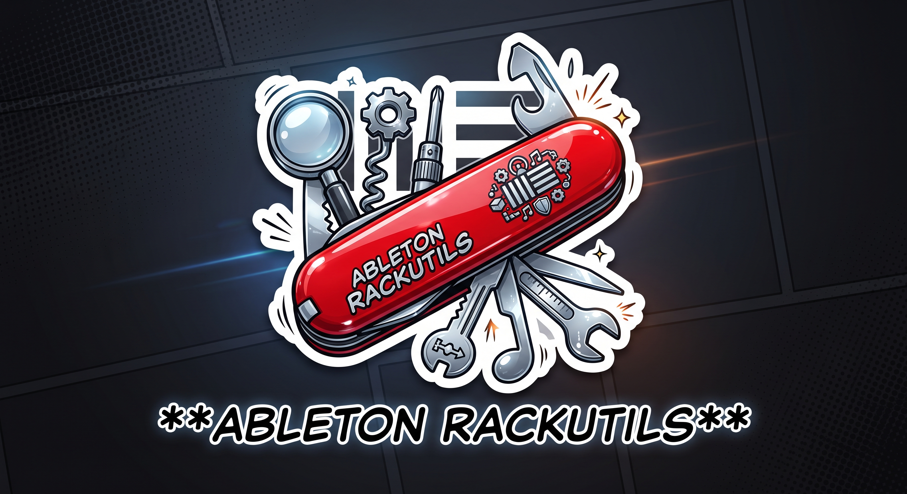

# ableton-rackutils

**v0.0.1 - pre-alpha. Does not work as a rack editor yet.** See status below.

**Live site:** https://alienmind.github.io/ableton-rackutils/

A Swiss-army toolkit for Ableton rack (`.adg`) files: a growing set of
utilities for inspecting and editing racks, from the browser or optionally from
inside Live via Max for Live. The first capability is a macro remapper -
rearrange rack macro mappings, move the mapping on knob 2 over to knob 3,
rebuild the `.adg`, reload it in Live - but the codec and the app shell are
built to host more rack-editing tools as they're added, not just this one.

**Status: pre-alpha, v0.0.1, early scaffold.** The site runs and can load a `.adg`, decompress it,
and show its raw XML structure - confirmed against a real 4000+ element rack.
It does not yet understand macros or mappings: the schema for that is
confirmed (`packages/adg-codec/SCHEMA.md`), the codec that reads and writes it
isn't built yet. See
[`doc/PLAN.md`](doc/PLAN.md#current-state-and-next-steps) for current state and
next steps.

> **Data loss warning.** This tool rewrites rack preset files. Bugs can produce
> a file that loads in Live without complaint and behaves incorrectly, including
> silently breaking every Macro Variation in the rack. Keep backups. The tool
> defaults to read-only until the codec is proven.

## What it is

A static website. No backend, no account, no upload. The `.adg` is parsed,
edited, and rebuilt in the browser tab and never leaves your machine, because
there is no server for it to go to.

An optional Max for Live companion device bundles the same UI offline inside an
`.amxd` and adds device targeting plus live parameter values.

## Why a file editor and not a live plugin

For the macro remap tool specifically: the Live Object Model exposes a macro's
current *value*, but never which parameter that macro drives. Not through Max's
`LiveAPI`, not through a Python Remote Script. So creating or moving a mapping
is necessarily a file operation. This constraint shapes the current design. See
`doc/PLAN.md` Part 2. Future rack-editing tools built on the same codec may or
may not share this constraint - check before assuming.

## Repo layout

```
packages/adg-codec/   parse, mutate, serialize .adg. No UI deps.
packages/editor-ui/   shared React components. No Ableton deps.
apps/m4l-device/      optional companion .amxd, built with m4l-jweb.
apps/site/            the product. Static, deployed to GitHub Pages.
tools/adg-inspect/    CLI for the schema investigation. Start here.
```

## Docs

Everything needed to continue is in the repo.

| File | What it is |
|---|---|
| [`doc/PLAN.md`](doc/PLAN.md) | Full implementation plan, phase by phase, with code. Opens with current state, next steps, and the constraints that rule out obvious designs. |
| [`packages/adg-codec/SCHEMA.md`](packages/adg-codec/SCHEMA.md) | Empty schema log. **Blocks all codec work.** |

## Getting started

Requires Node 20+ and pnpm 10.

```bash
pnpm install
```

### Run the web app

```bash
pnpm dev
```

Opens the site at `http://localhost:5173`. Drag a `.adg` file onto the page,
or use the file picker. It decompresses the file in the browser and shows the
raw XML tree, collapsed by default, click a node to expand it. Nothing is
uploaded, there is no server side to this at all.

This is a raw structure viewer, not the macro editor yet. The codec that
would power it (`packages/adg-codec`: parse a rack, move/swap/bind macro
mappings, all traced to `SCHEMA.md`) is built and tested - see "Testing the
codec" below - it just isn't wired into this page's UI yet.

To build a static production bundle:

```bash
pnpm build       # writes apps/site/dist
```

### Testing the codec

No UI needed - `packages/adg-codec` is usable on its own right now:

```bash
pnpm --filter @rackutils/adg-codec test         # 35 tests
pnpm adg-inspect mappings your-rack.adg         # list what's bound to what
pnpm adg-inspect move your-rack.adg 1 5 out.adg # move macro 1 -> macro 5
```

Drag `out.adg` into Live afterward to confirm the move actually holds up
there - see `doc/PLAN.md`'s "How to test the codec right now" for what to
look for, especially on a rack with Macro Variations.

### Run the companion Max for Live device (optional, scaffold only)

```bash
pnpm dev:device       # the device in a browser, mocked Live beside it
pnpm build:device     # writes apps/m4l-device/dist/@rackutils/m4l-device/rack-editor.amxd
pnpm install:device   # copies it into Ableton's User Library
```

No Max install needed for the first two. This is a scaffold: the device
confirms the bridge is alive and nothing else. See `apps/m4l-device/README.md`.

### Inspecting `.adg` schema by hand

```bash
pnpm adg-inspect unpack ~/path/to/rack.adg > rack.xml
pnpm adg-inspect diff before.adg after.adg
```

The tool used to fill in `packages/adg-codec/SCHEMA.md` in the first place -
useful again any time a new question comes up (a rack type, a field, an
inversion) that the current findings don't cover. Nothing in `adg-codec`
should model macros or mappings that aren't traceable to a diff recorded
there: guessing element names produces files that load in Live without
complaint and silently corrupt.

## Pipeline

| Workflow | Trigger | Does |
|---|---|---|
| `ci.yml` | PR, push to main | lint, typecheck, codec tests |
| `deploy.yml` | push to main | codec tests, then build and deploy to Pages |
| `release-device.yml` | push to main | build `rack-editor.amxd`, publish to the `latest-device` release (overwritten each push, no versioning yet) |

Codec tests gate the deploy. A broken codec corrupts racks silently, which is
worse than the site being down. The site's "download companion device"
button reads `release-device.yml`'s output live via the GitHub API - see
`doc/PLAN.md` Phase 4.5.

## Prior art

Other previous projects that I've been working on in the past, heavily reused for this one

- [`patchbay`](https://github.com/alienmind/patchbay) - Python DSL for authoring
  racks. Its `doc/SCHEMA.md` is the head start for Phase 1.
- [`m4l-jweb`](https://github.com/alienmind/m4l-jweb) - the framework the
  companion device is built on.
- [`m4l-strudel`](https://github.com/alienmind/m4l-strudel) - proves a full web
  app bundles offline into an `.amxd`.
- [`trackster`](https://github.com/alienmind/trackster) - the CI/CD, PWA, and
  File System Access patterns copied here.

## License

[MIT](LICENSE)
